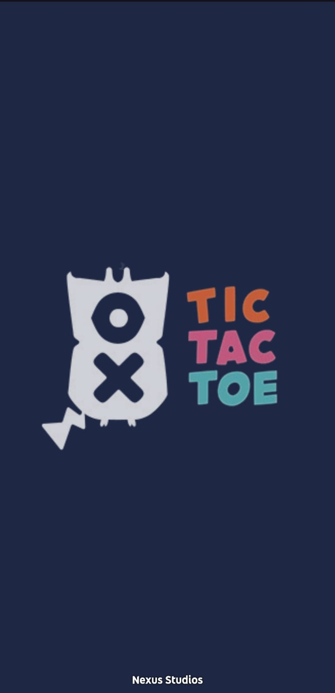
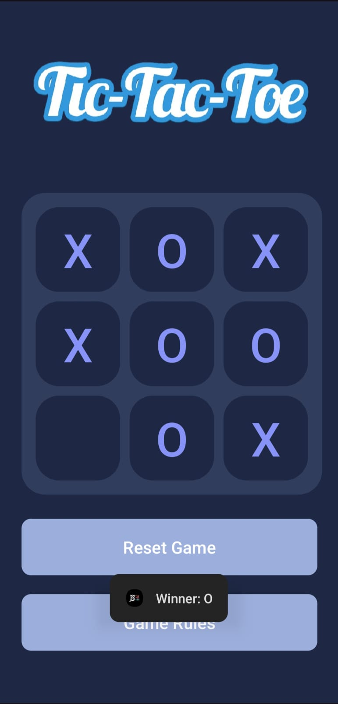
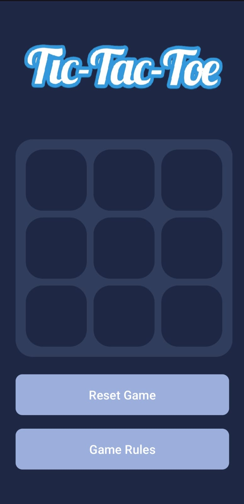

# 🎮 Tic Tac Toe – Classic Game, Android Edition

> A simple and fun **Tic Tac Toe** game built for Android. Whether you’re feeling competitive or just bored in class (hey, no judgment), this app is your go-to boredom killer.

---

## 🕹️ Features

- ✅ Classic 3x3 Tic Tac Toe gameplay  
- 👥 Two-player mode (Play on the same device)  
- 👤 Single-player mode (Play against AI) *(UPCOMING)*  
- 🧠 Fair and challenging AI (coming soon)  
- 🎨 Clean and user-friendly interface  
- ⚡ Lightweight and fast performance  
- 🚫 No ads, no BS – just pure gaming

---

## 📲 Download the APK

> Or grab it from the [Releases Page](https://github.com/your-username/tictactoe/releases) for version history and changelogs.

---

## 📦 APK Details

- **File:** [`tictactoe.apk`](./tictactoe.apk)  
- **Platform:** Android  
- **Min SDK:** *Add this info if you know it*  
- **Target SDK:** *Add if known*  
- **Size:** So small, your storage won't even notice  
- **Status:** Stable build – ready to play

---

## 📷 Screenshots

  
  
  

---

## 🚀 Installation Guide

1. Click the **Download APK** button above ☝️  
2. On your Android device, go to **Settings > Security > Unknown Sources** → Enable it  
3. Open the downloaded file and hit **Install**  
4. Boom! You're ready to play 🎉

---

## 🛠️ Tech Stack

- 💻 Android Studio  
- 🧾 Java / Kotlin *(specify your language)*  
- 🎨 XML for layout design  
- 🧪 Tested on multiple devices

---

## 🙌 Contributions

Pull requests are welcome!  
Feel free to fork, star, and suggest improvements. Got ideas for better AI? Want to add multiplayer over WiFi? Let's collab.

---

## ✨ Credits

Made with ❤️ by #Harshit #Goswami  
[GitHub](https://github.com/HarshitGoswamiii) • [LinkedIn](https://www.linkedin.com/in/harshitgoswamiii/) 

---

## 📄 License

This project is licensed under the [MIT License](LICENSE).
